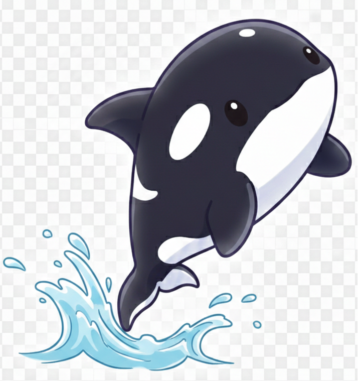

<div align="center">

<br>

<pre>
       .  *    +   .       *    .        *     +  .
             . *    .    .     *   .    .   .  *
          .        *   .    +      .  *        .
</pre>

<table cellpadding="0" cellspacing="0" border="0" align="center"><tr>
<td><pre>
  █████    █████     █████    █████
 ██   ██   ██  ██   ██        ██   ██
 ██   ██   █████    ██        ███████
 ██   ██   ██ ██    ██        ██   ██
  █████    ██  ██    █████    ██   ██
</pre></td>
<td valign="bottom"></td>
</tr></table>

<pre>
          C H I L D   I N   T H E   W I L D

       ---- Protecting Our Waters from Shore to Sea ----

         ~ ~~ ~~~ ~~  ~ ~~~ ~~ ~ ~~~  ~ ~~ ~~~ ~~ ~
       ~~~~~~~~~~~~~~~~~~~~~~~~~~~~~~~~~~~~~~~~~~~~~~~~~~~~
</pre>

<br>

<h3><em>"Every kid who picks up a piece of trash on the beach<br>without being asked is already an ocean steward.<br>They just need someone to tell them that matters."</em></h3>

<br>

<strong>A youth-run nonprofit dedicated to ocean, marine, river, lake, and pond conservation</strong><br>
<em>across Southern California — from Los Angeles to San Diego</em>

<br>

[](https://www.orcachildinthewild.com)
&nbsp;&nbsp;
[](#)

<br>

[](https://nextjs.org/)
[](https://www.typescriptlang.org/)
[](https://react.dev/)
[](https://tailwindcss.com/)
[](https://supabase.com/)
[](https://zod.dev/)
[](#license)

<br>

</div>

<!-- ━━━━━━━━━━━━━━━━━━━━━━━━━━━━━━━━━━━━━━━━━━━━━━━━━━━━━━━━━━━━━━━━━━━━━━━ -->

<div align="center">
<table>
<tr>
<td align="center" width="120"><strong>238</strong><br><sub>Tests Passing</sub></td>
<td align="center" width="120"><strong>23</strong><br><sub>Content Pages</sub></td>
<td align="center" width="120"><strong>10+</strong><br><sub>Species Profiles</sub></td>
<td align="center" width="120"><strong>7</strong><br><sub>Tide Stations</sub></td>
<td align="center" width="120"><strong>14</strong><br><sub>Vulns Resolved</sub></td>
<td align="center" width="120"><strong>2</strong><br><sub>Languages</sub></td>
</tr>
</table>
</div>

<!-- ━━━━━━━━━━━━━━━━━━━━━━━━━━━━━━━━━━━━━━━━━━━━━━━━━━━━━━━━━━━━━━━━━━━━━━━ -->

<br>

## 🐋 &nbsp; Why We Exist

There's a moment every kid from Southern California knows. You're standing at the waterline, barefoot, and a wave rolls in and wraps around your ankles. For a second, you're connected to something enormous — something alive. You look out and the Pacific goes on forever.

That feeling is why Orca Child in the Wild exists.

**The "Orca Child" is Jordyn Rosario** — but it's also every kid who has ever looked at the ocean and felt like it was theirs to protect. Every child who picks up trash on the beach without being asked. Every teenager who can name the species in a tidepool. Every young person who understands that their future depends on the health of the water. **That's an orca child.** And they're everywhere.

Founded by **Jordyn and family** in Carlsbad, California, this nonprofit was born from a simple truth: the next generation of ocean stewards is already here. They don't need to wait for permission. They don't need to grow up first. They need tools, community, and a little help getting organized.

> Southern California's coastline is one of the most biodiverse marine corridors in the world. Gray whales migrate through our waters every winter. Leopard sharks nurse in the shallows of La Jolla. Kelp forests off Palos Verdes shelter thousands of species. And all of it is under threat — from pollution, from warming, from the slow erosion of people forgetting to care.

We're building a generation that doesn't forget.

<br>

<!-- ━━━━━━━━━━━━━━━━━━━━━━━━━━━━━━━━━━━━━━━━━━━━━━━━━━━━━━━━━━━━━━━━━━━━━━━ -->

## 🌊 &nbsp; What This Platform Does

This isn't just a website. It's a conservation tool — built to organize beach cleanups, track marine life, educate communities, and turn young ocean lovers into activists.

<table>
<tr>
<td width="50%" valign="top">

### 🦈 &nbsp; Conservation Hub
Coordinate beach cleanups, track restoration projects,
measure community impact. Every event gets kids to the
waterline where the learning happens.

### 🐚 &nbsp; Species Profiles
10+ Southern California marine species you can actually see
from shore — gray whales, orcas, sea otters, garibaldi,
leopard sharks. Written so a kid can teach their parents.

### 📖 &nbsp; Educational Content
23 articles on citizen science, marine protected areas,
what to do when you find a stranded seal, how kelp forests
work, and why the grunion runs matter.

### 🌡️ &nbsp; Live Weather & Tides
Real-time ocean conditions from NOAA and Open-Meteo —
because you need to know the tides before a cleanup,
and the surf before a lesson.

</td>
<td width="50%" valign="top">

### 🙋 &nbsp; Volunteer System
Age-gated signup that **actually protects kids**. COPPA-compliant
parental consent with a phone-verified code system.
Zero child data collected until a parent says yes.

### 📅 &nbsp; Events & Registration
Beach cleanups, species surveys, educational workshops.
Capacity tracking, waitlists, iCal downloads.
Under-16 volunteers get a parent-present notice because
this is real life, not just a form.

### 💙 &nbsp; Donation Portal
Zero-fee donations through Zeffy. Every single dollar goes
to conservation — not credit card processors. Because when
a kid runs a lemonade stand for the ocean, that money matters.

### 🌐 &nbsp; Fully Bilingual
Complete English and Spanish support. Because the families
who live closest to these beaches speak both languages,
and conservation belongs to everyone.

</td>
</tr>
</table>

<br>

<!-- ━━━━━━━━━━━━━━━━━━━━━━━━━━━━━━━━━━━━━━━━━━━━━━━━━━━━━━━━━━━━━━━━━━━━━━━ -->

## 🗺️ &nbsp; The Waters We Protect

<div align="center">

*From the Santa Monica Pier to the Imperial Beach boardwalk — 120 miles of coastline we call home.*

```
                        Santa Monica  🏖️
                             ╲
           Los Angeles  🌊 ── ╋ ── Long Beach  ⚓
                              │
                        Newport Beach  🐚
                              │
                         La Jolla  🦭
                              │
                        San Diego  🐋
                              │
                      Imperial Beach  🌅
```

</div>

<table>
<tr>
<td width="33%" valign="top">

**🌊 Tide Stations We Monitor**

Seven NOAA stations along our coast, giving us
real-time data on what the ocean is doing right now.

- Santa Monica (9410840)
- Los Angeles (9410660)
- Long Beach (9410680)
- Newport Beach (9410580)
- La Jolla (9410230)
- San Diego (9410170)
- Imperial Beach (9410120)

</td>
<td width="33%" valign="top">

**🌿 Ecosystems We Study**

Every one of these is a classroom. Every one
of these is worth fighting for.

- Kelp Forests
- Coastal Wetlands
- Sandy Beaches
- Rocky Intertidal
- Open Ocean
- Freshwater Systems

</td>
<td width="34%" valign="top">

**🐋 Species We Track**

These are our neighbors. Kids learn their
names, their habits, their struggles.

- California Gray Whales
- Blue Whales & Orcas
- Sea Lions & Harbor Seals
- Southern Sea Otters
- Brown Pelicans
- California Grunion
- Garibaldi (our state fish!)
- Leopard Sharks

</td>
</tr>
</table>

<br>

<!-- ━━━━━━━━━━━━━━━━━━━━━━━━━━━━━━━━━━━━━━━━━━━━━━━━━━━━━━━━━━━━━━━━━━━━━━━ -->

## ⚡ &nbsp; Built With

We built this the way we build sandcastles — with care, with the best tools we could find, and with the understanding that the ocean will test everything.

<table>
<tr>
<td align="center" width="96">

<br><sub><b>Next.js 16</b></sub>
</td>
<td align="center" width="96">

<br><sub><b>React 19</b></sub>
</td>
<td align="center" width="96">

<br><sub><b>TypeScript</b></sub>
</td>
<td align="center" width="96">

<br><sub><b>Tailwind v4</b></sub>
</td>
<td align="center" width="96">

<br><sub><b>Supabase</b></sub>
</td>
<td align="center" width="96">

<br><sub><b>PostgreSQL</b></sub>
</td>
<td align="center" width="96">

<br><sub><b>Vitest</b></sub>
</td>
<td align="center" width="96">

<br><sub><b>CI/CD</b></sub>
</td>
</tr>
</table>

<details>
<summary><strong>📋 &nbsp; Full Stack Breakdown</strong></summary>
<br>

| Layer | Technology | Purpose |
|:------|:-----------|:--------|
| **Framework** | Next.js 16 (App Router) | Server/client hybrid rendering |
| **Language** | TypeScript (strict mode) | Type safety everywhere |
| **UI** | React 19 + shadcn/ui + Radix | Accessible component primitives |
| **Styling** | Tailwind CSS v4 | Utility-first, CSS-based theming |
| **Content** | MDX + Velite | 23 articles, species, ecosystems |
| **Database** | Supabase (PostgreSQL) | RLS on every table |
| **Auth** | Supabase Auth + RBAC | 4 admin roles |
| **Validation** | Zod v4 | Client + server, same schemas |
| **i18n** | next-intl | EN/ES with locale routing |
| **Weather** | Open-Meteo API | Free, no key required |
| **Tides** | NOAA CO-OPS API | 7 SoCal stations monitored |
| **Donations** | Zeffy | $0 processing fees |
| **Email** | Resend | Transactional email |
| **Icons** | Lucide React | Consistent icon library |
| **Maps** | Leaflet + OpenStreetMap | Interactive conservation maps |
| **Charts** | Recharts | Tide visualizations |
| **Testing** | Vitest + Playwright + axe-core | Unit, E2E, accessibility |
| **Hosting** | Hostinger VPS + Nginx + PM2 | Ubuntu 24.04, Let's Encrypt SSL |
| **CI/CD** | GitHub Actions | Lint, type-check, test, build |

</details>

<br>

<!-- ━━━━━━━━━━━━━━━━━━━━━━━━━━━━━━━━━━━━━━━━━━━━━━━━━━━━━━━━━━━━━━━━━━━━━━━ -->

## 🔒 &nbsp; Security & Privacy

> **This site serves minors. That's not a checkbox — it's a responsibility.**
>
> Every kid who signs up to clean a beach deserves the same data protection as an adult at a bank. We built it that way on purpose.

<table>
<tr>
<td width="50%" valign="top">

**Legal Compliance**
- ✅ &nbsp; **COPPA** — Verifiable parental consent for under-13
- ✅ &nbsp; **CCPA** — Soft-delete pattern, data deletion rights
- ✅ &nbsp; **WCAG 2.1 AA** — Full accessibility compliance

</td>
<td width="50%" valign="top">

**Technical Protections**
- 🛡️ &nbsp; Row Level Security on every Supabase table
- 🛡️ &nbsp; CSRF origin validation on all form submissions
- 🛡️ &nbsp; Per-IP rate limiting on all API routes
- 🛡️ &nbsp; Zero PII in error logs
- 🛡️ &nbsp; Strict Content Security Policy
- 🛡️ &nbsp; `pnpm audit` on every deployment

</td>
</tr>
</table>

<details>
<summary><strong>🔐 &nbsp; How We Protect Kids — Parental Consent System</strong></summary>
<br>

Our consent system was designed with one rule: **zero child data until a real parent says yes.**

No automated emails. No "click here to consent." A human from our team calls the parent, verifies they're real, and only then generates a single-use code. It's slower than an algorithm. It's also safer.

```
┌─────────────────────────────────────────────────────────────────┐
│  1. Minor selects age range                                     │
│     └─ Form hides ALL personal fields                           │
│  2. Only parent contact info collected (name, email, phone)     │
│     └─ Stored in parent_consent_requests table                  │
│  3. Our team calls parent, verifies identity by phone           │
│     └─ Manual verification — we believe in the human touch      │
│  4. Admin generates 9-character alphanumeric consent code        │
│     └─ Single-use, 30-day expiry, ~101 trillion combinations   │
│  5. Parent provides code to child                               │
│     └─ Code validates → full form unlocks                       │
│  6. Minor completes registration with verified consent          │
│     └─ Code consumed, parent_consent = "verified"               │
└─────────────────────────────────────────────────────────────────┘
```

</details>

<br>

<!-- ━━━━━━━━━━━━━━━━━━━━━━━━━━━━━━━━━━━━━━━━━━━━━━━━━━━━━━━━━━━━━━━━━━━━━━━ -->

## 📊 &nbsp; Performance Targets

*Because a kid on a school Chromebook over mobile hotspot deserves the same experience as a developer on fiber.*

<div align="center">
<table>
<tr>
<td align="center" width="150">
<h3>90+</h3>
<sub>Lighthouse<br>Performance</sub>
</td>
<td align="center" width="150">
<h3>💯</h3>
<sub>Lighthouse<br>Accessibility</sub>
</td>
<td align="center" width="150">
<h3>< 2.5s</h3>
<sub>Largest Contentful<br>Paint</sub>
</td>
<td align="center" width="150">
<h3>< 0.1</h3>
<sub>Cumulative<br>Layout Shift</sub>
</td>
<td align="center" width="150">
<h3>< 100ms</h3>
<sub>First Input<br>Delay</sub>
</td>
</tr>
</table>
</div>

<br>

<!-- ━━━━━━━━━━━━━━━━━━━━━━━━━━━━━━━━━━━━━━━━━━━━━━━━━━━━━━━━━━━━━━━━━━━━━━━ -->

## 🚀 &nbsp; Getting Started

```bash
# Clone the repository
git clone https://github.com/OrcaChild/ocinw-website.git
cd ocinw-website

# Install dependencies
pnpm install

# Copy environment variables
cp .env.example .env.local
# Edit .env.local with your Supabase keys

# Start the development server
pnpm dev
```

<details>
<summary><strong>📜 &nbsp; All Available Commands</strong></summary>
<br>

| Command | Description |
|:--------|:------------|
| `pnpm dev` | Start dev server (webpack mode) |
| `pnpm build` | Generate content + production build |
| `pnpm lint` | Run ESLint |
| `pnpm type-check` | TypeScript type checking |
| `pnpm test` | Run all 238 unit tests |
| `pnpm test:e2e` | Run Playwright end-to-end tests |
| `pnpm test:a11y` | Run accessibility tests via axe-core |
| `pnpm velite` | Generate content module from MDX |

</details>

<details>
<summary><strong>📁 &nbsp; Project Structure</strong></summary>
<br>

```
src/
├── app/                         # Next.js App Router
│   ├── [locale]/                # Locale-prefixed routes (en/, es/)
│   │   ├── about/               # Mission, team, story
│   │   ├── conservation/        # Events, projects, impact
│   │   ├── learn/               # Species, ecosystems, articles
│   │   ├── volunteer/           # Signup form with consent system
│   │   ├── donate/              # Zeffy integration
│   │   ├── contact/             # Contact form
│   │   └── weather/             # Live weather & tide dashboard
│   ├── actions/                 # Server actions (form handlers)
│   └── api/                     # API routes (iCal, webhooks)
├── components/                  # React components
│   ├── ui/                      # shadcn/ui primitives
│   ├── layout/                  # Navigation, footer, skip-to-content
│   ├── shared/                  # Reusable components
│   ├── weather/                 # Weather & tide widgets
│   ├── events/                  # Event cards, registration
│   ├── volunteer/               # Volunteer form + consent flow
│   └── education/               # Species, ecosystem, article cards
├── lib/                         # Utilities, hooks, types, API clients
└── i18n/                        # Internationalization config

content/                         # MDX content files
├── species/                     # Marine species profiles
├── ecosystems/                  # Ecosystem guides
├── articles/                    # Educational articles
└── projects/                    # Conservation project descriptions

messages/                        # Translation files (en.json, es.json)
supabase/                        # Database schema & migrations
tests/                           # Vitest unit + Playwright E2E tests
```

</details>

<br>

<!-- ━━━━━━━━━━━━━━━━━━━━━━━━━━━━━━━━━━━━━━━━━━━━━━━━━━━━━━━━━━━━━━━━━━━━━━━ -->

## 🤝 &nbsp; Contributing

We welcome contributions from developers, marine biologists, educators, and anyone who has ever looked at the ocean and felt something.

1. **Fork** the repository
2. **Create** a feature branch — `git checkout -b feat/your-feature`
3. **Follow** our code standards (TypeScript strict, Zod validation, accessible components)
4. **Run** the quality gates:
   ```bash
   pnpm lint && pnpm type-check && pnpm test && pnpm build
   ```
5. **Open** a pull request

<br>

<!-- ━━━━━━━━━━━━━━━━━━━━━━━━━━━━━━━━━━━━━━━━━━━━━━━━━━━━━━━━━━━━━━━━━━━━━━━ -->

## 📄 &nbsp; License

This project is **proprietary**. All rights reserved.
See [LICENSE](LICENSE) for details.

For licensing inquiries: [orcachildinthewild@gmail.com](mailto:orcachildinthewild@gmail.com)

<br>

<!-- ━━━━━━━━━━━━━━━━━━━━━━━━━━━━━━━━━━━━━━━━━━━━━━━━━━━━━━━━━━━━━━━━━━━━━━━ -->

<div align="center">

<br>

```
  .  . *    .    .  .    *   .    .   .  *   .    .
     .    .    *  .    .    .    *  .    .    .    *
  .    .  .    .    .   .  *   .    .  .    . *   .
```

<br>

*An "orca child" is any kid who looks at the ocean*
*and feels like it belongs to them — and they to it.*

*Jordyn is one. Your kid might be one too.*
*This platform exists so they can do something about it.*

<br>

```
         +-------------------------------+
         |   Every wave starts with a    |
         |       single drop.            |
         +-------------------------------+

  ~~~~~~~~~~~~~~~~~~~~~~~~~~~~~~~~~~~~~~~~~~~~
   ~~~    ~~~    ~~~    ~~~    ~~~    ~~~    ~~~
     ~ ~ ~   ~ ~ ~   ~ ~ ~   ~ ~ ~   ~ ~ ~
```

<br>

**Built with love for the ocean by Jordyn Rosario and the Orca Child family.**

*Carlsbad, California*

<br>

[](https://www.orcachildinthewild.com)

<br>

</div>
